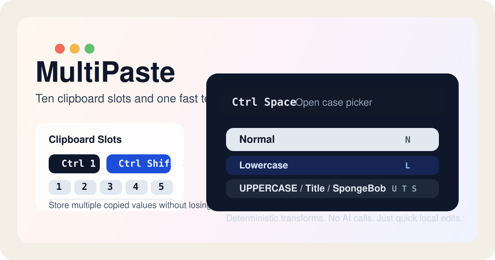

[Download MultiPaste for Mac](https://github.com/ishaan0x/MultiPaste/releases/latest/download/MultiPaste.zip)

# MultiPaste

MultiPaste is a lightweight macOS menu bar app for ten independent clipboard slots.



## Hotkeys

- `Control` + `1` through `0`: copy current selection into slot `1` through `10`
- `Control` + `Shift` + `1` through `0`: paste from slot `1` through `10`
- `Control` + `Space`: open the casing picker

Inside the casing picker:

- `Up` / `Down`: move between options
- `Return`: apply the highlighted option
- `N`, `L`, `U`, `T`, `S`: jump directly to `Normal`, `Lowercase`, `Uppercase`, `Title Case`, or `SpongeBob`
- `Escape`: cancel

`0` maps to slot `10`.

## How it works

When you trigger a copy hotkey, the app simulates `Command-C`, waits briefly for the target app to update the system clipboard, then stores the clipboard contents in the selected slot.

When you trigger a paste hotkey, the app restores that slot to the system clipboard and simulates `Command-V`.

When you trigger the casing picker, the app copies the current selection, lets you choose a casing transform from a small popup, then pastes the transformed text back, reselects that transformed text, and restores your previous clipboard contents. `Normal` uses sentence-case heuristics, and SpongeBob casing uses a deterministic seeded pattern with about 42% uppercase letters on average.

## Permissions

The app needs macOS Accessibility permission so it can simulate `Command-C` and `Command-V`.

On first launch, macOS should prompt you to allow access for the built binary or terminal host that runs it.

## Install

### Download the app

Download [MultiPaste.zip](https://github.com/ishaan0x/MultiPaste/releases/latest/download/MultiPaste.zip).

### First launch

1. Unzip `MultiPaste.zip`.
2. Drag `MultiPaste.app` into `Applications`.
3. Open `Applications`, then right-click `MultiPaste.app` and choose `Open`.
4. Click through the macOS warning once.
5. Grant Accessibility access when macOS prompts, or enable `MultiPaste` manually in `System Settings` > `Privacy & Security` > `Accessibility`.

After that, MultiPaste should run as a menu bar app with an `MP` label.

## Build From Source

To build and run the local development version:

```bash
./run.sh
```

## Package a Downloadable App

To build an unsigned `.app` bundle and zip it for a GitHub release:

```bash
./scripts/package_app.sh 0.2.0
```

This creates:

- `dist/MultiPaste.app`
- `dist/MultiPaste.zip`

## GitHub Releases

This repo includes a GitHub Actions workflow at `.github/workflows/release.yml`.

- Push a tag like `v0.2.0` to upload `MultiPaste.zip` to that release.
- Or run the workflow manually from the Actions tab and enter a version.

The app is unsigned and not notarized, so macOS will show a warning on first open. That is expected for this distribution model.
